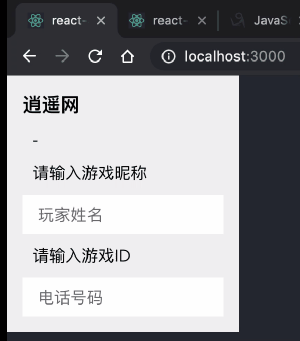

# react-lss-autocomplete

> 通过共享存储提供输入建议，提高信息输入效率

[](https://www.npmjs.com/package/react-autocomplete) [](https://standardjs.com)

## Demo


## Install

```bash
npm install --save react-lss-autocomplete
```

## Usage

组件监听所有`input`输入事件,在输入框下方生成一个建议值列表，值的来源是所有共享域名体系下的历史输入值，并会根据该值出现的频率进行自动排序

```jsx
import React, { Component } from 'react'

import Rlac from 'react-lss-autocomplete'

class Example extends Component {
  render () {
    return (
        <Rlac>         
          <p>请输入游戏昵称</p>
          <input name='xsplayer' type='text' placeholder={'玩家姓名'} />
        </Rlac>
    )
  }
}
```

## Example

在逍遥网输入过的游戏ID信息会被保存到本地共享存储中，剑三网的输入推荐列表可以读取到并作为建议项，亲自测试👇
* [逍遥网](https://browniu.github.io/react-lss-autocomplete/)
* [剑三网](https://browniu.github.io/react-lss-autocomplete-example/)
      
## License

MIT © [browniu](https://github.com/browniu)
